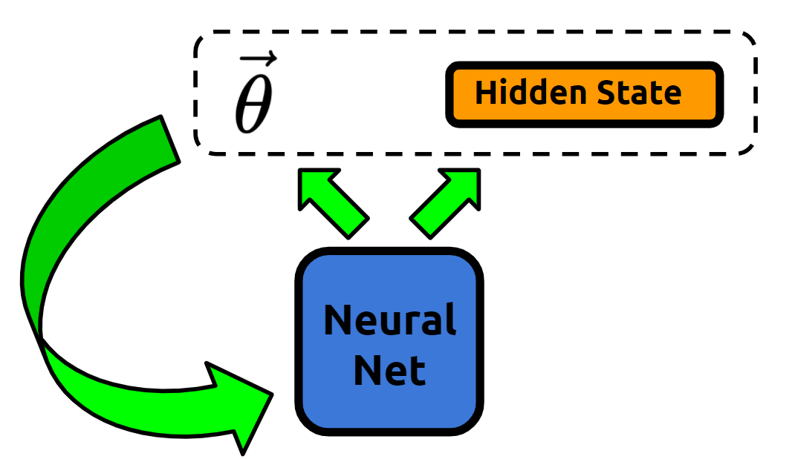
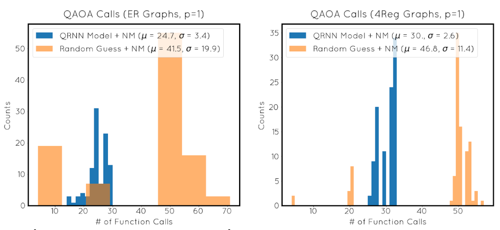

# RNN_QAOA
Optimizing the performance of the Quantum Approximate Optimizaton Algorithm (QAOA) using recurrent neural networks. 

The QAOA (https://arxiv.org/abs/1411.4028) is a variational quantum algorithm for approximating the ground state of some Hamiltonian, H. The quality of the approximation obtained from the QAOA depends on several input parameters, &gamma; and &beta; . In this project, I used metalearning in order to find optimial values of &gamma; and &beta; much faster than what was obtained by using classical optimization techniques alone. 

  

* The model tries to maximize the average performance of the QAOA on the MaxCut problem across a collection of 3-Regular, 4-Regular, and Erdos-Renyi graphs of varying densities.
* The model is trained to find the optimal values of &gamma; and &beta;, as was proposed in https://arxiv.org/abs/1907.05415. 

  

# What I've Learned
* How the QAOA works from a physics and a computational perspective
* How reinforcement learning works from a computational and mathematical perspective 
* How to implement a metalearner in tensorflow
* How to build custom models in tensorflow
